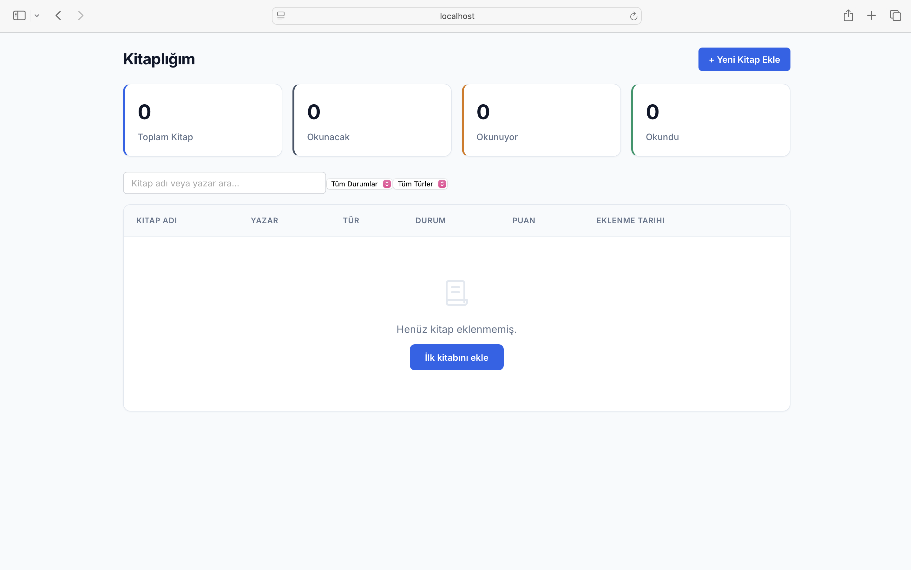
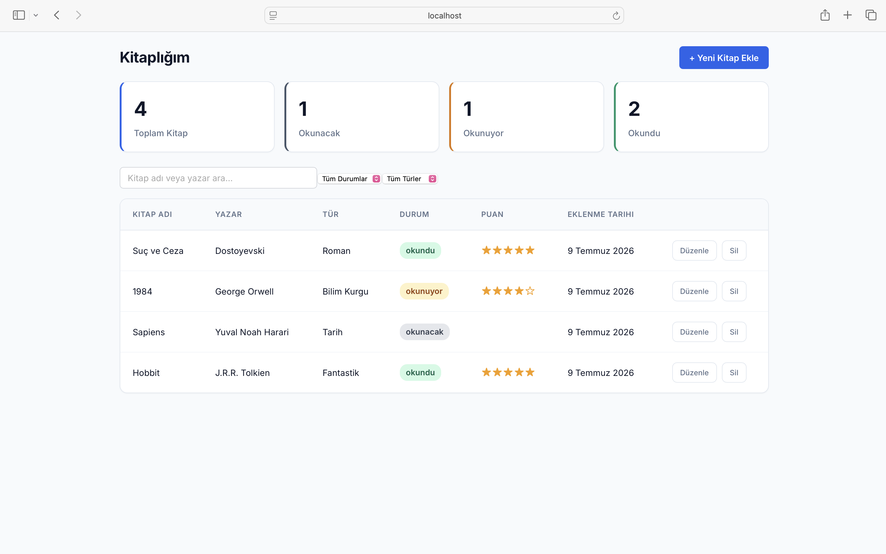
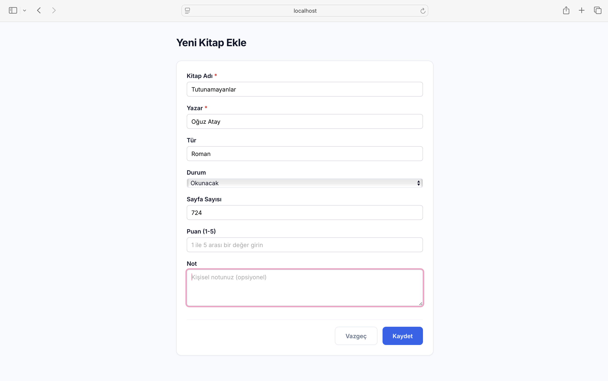
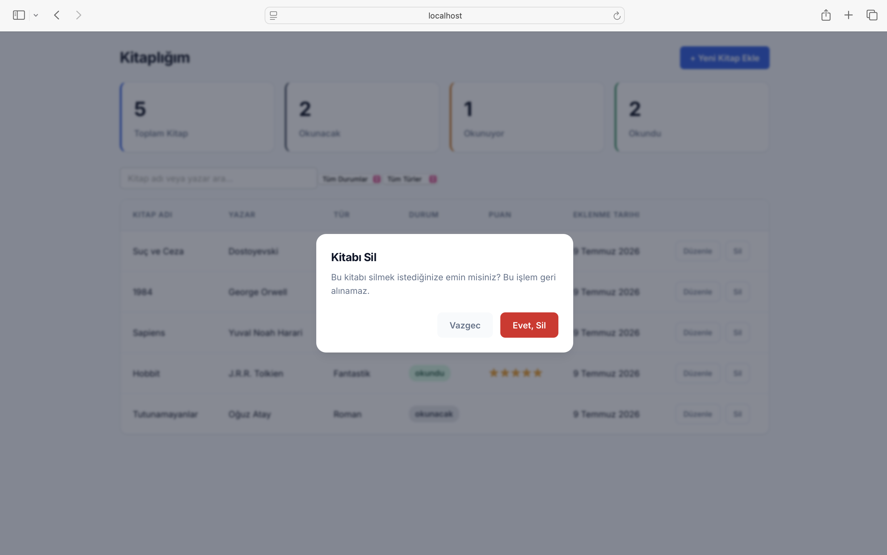

# 📚 Kitaplık ve Okuma Listesi

Kullanıcının okuduğu, okuyacağı ve okumakta olduğu kitapları takip edebileceği kişisel bir kütüphane uygulaması. Angular ve localStorage kullanılarak geliştirilmiştir.

🔗 **Canlı Demo:** [kitaplik-okuma-listesi.vercel.app](https://kitaplik-okuma-listesi.vercel.app)

## ✨ Özellikler

- **Kitap Ekleme / Düzenleme / Silme** — Reactive Forms ile tam CRUD desteği
- **Okuma Durumu Takibi** — Okunacak / Okunuyor / Okundu (renkli rozetlerle görselleştirilir)
- **1-5 Yıldız Puanlama**
- **Arama ve Filtreleme** — Ad/yazara göre arama, türe ve okuma durumuna göre filtreleme
- **Sıralama** — Tüm kolonlara göre artan/azalan sıralama
- **Silme Onayı** — Geri alınamaz işlemlerde confirm dialog
- **Kaydedilmemiş Değişiklik Uyarısı** — Formda değişiklik varken sayfadan ayrılmaya çalışınca uyarı
- **Kalıcı Veri** — Tüm veriler tarayıcının localStorage'ında saklanır, sayfa yenilenince kaybolmaz

## 🛠️ Kullanılan Teknolojiler

- **Angular 17** — Standalone components, Signals, yeni `@if`/`@for` control flow syntax'ı
- **TypeScript**
- **RxJS** — Servis katmanında `BehaviorSubject` / `Observable` ile state yönetimi
- **Reactive Forms** — Form doğrulama ve custom validator'lar
- **SCSS** — CSS custom properties (design tokens) ile tutarlı bir görsel dil
- **localStorage** — Veri kalıcılığı için (backend yok)

## 📁 Proje Yapısı

Proje, **feature-based mimari** ile core / shared / features katmanlarına ayrılmıştır:

\`\`\`
src/app/
├── core/                    # Uygulama genelinde paylaşılan yapılar
│   ├── guards/              # Route guard'lar
│   └── services/            # StorageService, ConfirmDialogService
├── shared/                  # Yeniden kullanılabilir bileşenler
│   ├── components/
│   │   ├── data-table/
│   │   ├── confirm-dialog/
│   │   ├── form-field/
│   │   ├── empty-state/
│   │   └── loading-spinner/
│   ├── directives/
│   ├── pipes/
│   └── validators/
└── features/
    └── books/               # Kitap özelliğine ait her şey
        ├── pages/
        │   ├── books-list/
        │   └── books-form/
        ├── services/
        └── models/
\`\`\`

- **core:** Tüm uygulamada paylaşılan servisler ve guard'lar (`StorageService`, `ConfirmDialogService`, `unsavedChangesGuard`).
- **shared:** Birden fazla yerde kullanılan bileşenler, pipe'lar, directive'ler ve validator'lar.
- **features/books:** Kitap özelliğine özel sayfalar, servis ve model.

## 🚀 Kurulum

Projeyi kendi bilgisayarınızda çalıştırmak için:

\`\`\`bash
# Depoyu klonlayın
git clone https://github.com/acarlarilayda/kitaplik-okuma-listesi.git

# Proje klasörüne girin
cd kitaplik-okuma-listesi

# Bağımlılıkları yükleyin
npm install

# Geliştirme sunucusunu başlatın
ng serve
\`\`\`

Uygulama varsayılan olarak `http://localhost:4200` adresinde açılır.

## 🖼️ Ekran Görüntüleri

### Boş Durum

### Kitap Listesi

### Yeni Kitap Ekleme

### Silme Onayı
